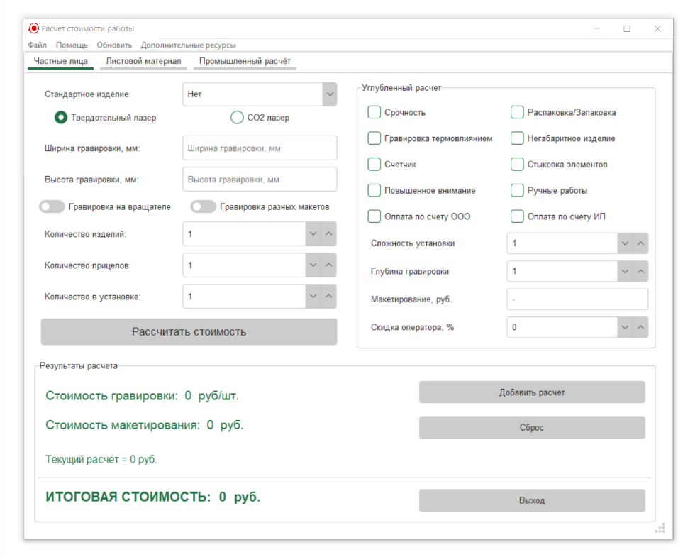
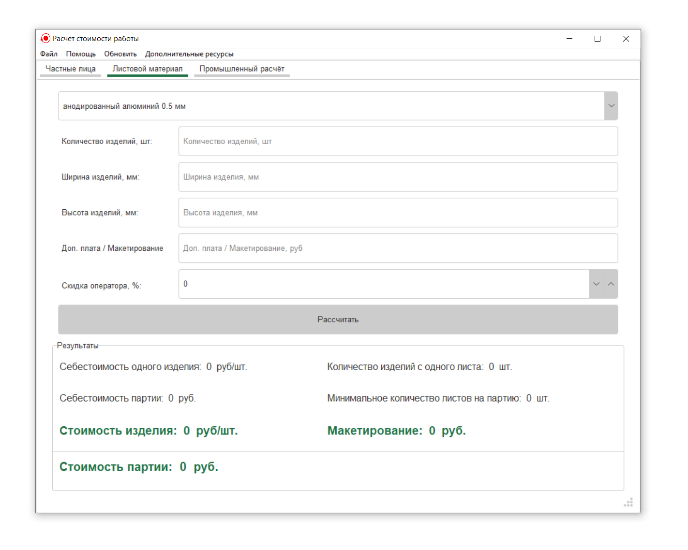
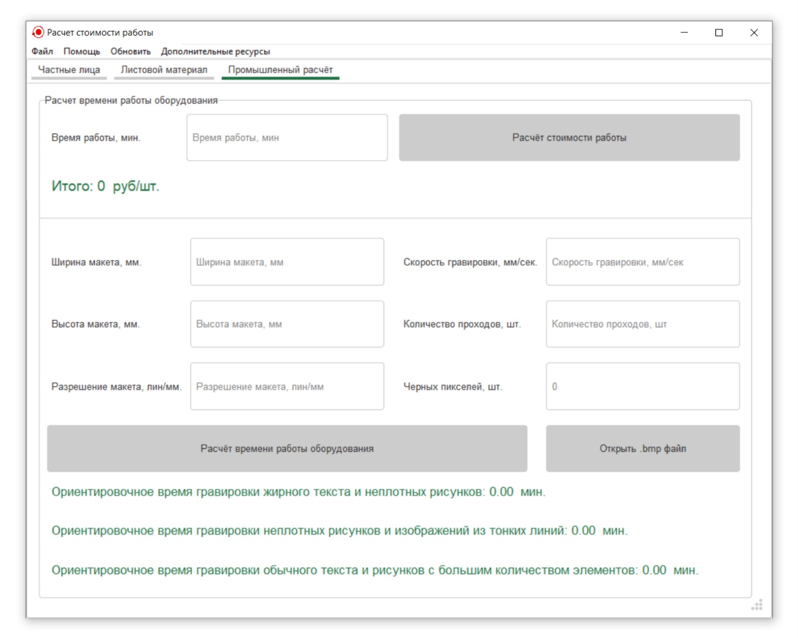

Приложение создано для компании РАЗУМ (https://razoom-laser.ru/).

## Описание
**Razoom-Calculate** — это приложение для автоматизации расчётов, связанных с гравировкой и обработкой изделий из листового материала.
Программа предназначена для операторов лазерного оборудования и позволяет:
- Рассчитывать стоимость гравировки отдельных изделий и партий;
- Рассчитывать стоимость изготовления изделий из листового материала;
- Производить приблизительный расчёт времени гравировки по макету `.bmp` (расчёт временных затрат);
- Подбирать оптимальные режимы для глубокой гравировки;
- Работать с внутренней документацией компании и другими дополнительными ресурсами.

---

## Системные требования
- **Операционная система**: <code>Windows 10</code> и выше;
- **Процессор**: <code>Intel Core i3</code> или аналогичный и выше;
- **Память**: <code>2 ГБ</code> оперативной памяти;
- **Свободное место на диске**: <code>100 МБ</code>;
- **Разрешение экрана**: <code>1024x768</code> или выше.

---

## Установка
1. Скачайте установочный файл с [релиза]() проекта.
2. Запустите установочный файл `RazoomCalculate_1.0_setup.exe`.
3. Следуйте инструкциям мастера установки.
4. **Важно:** Не устанавливайте приложение в папку `Program Files`, чтобы 
   избежать необходимости запуска с правами администратора. Это связано с тем, что приложение записывает временные данные и пользовательские настройки в свою директорию.

---

## Главное окно. Основные возможности
1. **Вкладка Частные лица**
   

На вкладке осуществляется расчёт стоимости работы для изделий частных лиц (включая партии изделий), а также расчёт стоимости партии изделий для промышленных объёмов.

2. **Вкладка Листовой материал**
   

На вкладке осуществляется расчёт стоимости изготовления изделий из листового материала, включая стоимость макетирования, себестоимость и потребное количество материала на партию;

3. **Вкладка Промышленный расчет**
   

На вкладке осуществляется расчёт стоимости гравировки от времени работы оборудования, а также приближенный расчёт времени, занимаемого гравировкой выбранного пользователем <code>.bmp</code> макета;

4. **Полоса меню**
   

Располагается в верхней части главного окна приложения и предоставляет доступ к основным настройкам, справочным материалам, а также дополнительным функциям программы;

## Дополнительные возможности
1. **Подбор параметров глубокой гравировки**
   

Приложение позволяет осуществлять подбор оптимальных параметров для глубокой гравировки. Окно подбора параметров открывается через меню приложения <code>Файл → Глубокая гравировка</code>.

2. **Работа с дополнительными ресурсами и внутренней документацией**
   

Осуществляется через меню приложения <code>Дополнительные ресурсы 
   → Название ресурса</code>.

   
3. **Просмотр и анализ расчетов**
   

В приложении есть возможность просмотра расчетов. 
   Осуществляется через меню приложения: <code>Файл → Название 
   ресурса</code>.

4. **Настройки и конфигурация**
   

Приложение поддерживает гибкую настройку параметров, а также поддержку стандартных и пользовательских конфигураций.

   - Окно настроек приложения можно открыть через меню: <code>Файл → Настройки программы</code>.

   - Окно настроек листового материала можно открыть через меню: <code>Файл → Листовой материал</code>.

---

## Документация
Полное руководство пользователя доступно:
- В меню приложения ("Помощь" → "Руководство пользователя").
- В директории приложения `/Razoom-Calculate/resources/help/user_guide.pdf`.

Справка по программе доступна:
- В меню приложения ("Помощь" → "Справка").
- В директории приложения `/Razoom-Calculate/resources/help/AppHelp.chm`.

---

## Поддержка
Если вы обнаружили ошибку или у вас есть предложение по улучшению программы:
1. Создайте Issue в репозитории GitHub.
2. Напишите на почту: yakushev_vladislav@mail.ru
3. Напишите в telegram: @yakush_ev

---

## Лицензия

Copyright (c) 2024 Yakushev Vladislav

Licensed under the Apache License, Version 2.0 (the "License");
you may not use this file except in compliance with the License.
You may obtain a copy of the License at

    http://www.apache.org/licenses/LICENSE-2.0

Unless required by applicable law or agreed to in writing, software
distributed under the License is distributed on an "AS IS" BASIS,
WITHOUT WARRANTIES OR CONDITIONS OF ANY KIND, either express or implied.
See the License for the specific language governing permissions and
limitations under the License.

This project makes use of the following libraries included in Python's standard library:
- configparser (PSF License)
- logging (PSF License)
- math (PSF License)
- os (PSF License)
- shutil (PSF License)
- sys (PSF License)
- textwrap (PSF License)
- tkinter (PSF License)
- webbrowser (PSF License)

This project uses the following third-party libraries:
- Custom-Tooltip (MIT License)
- Forest-ttk-theme (MIT License)

---

